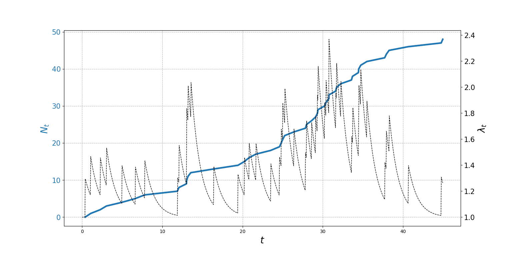
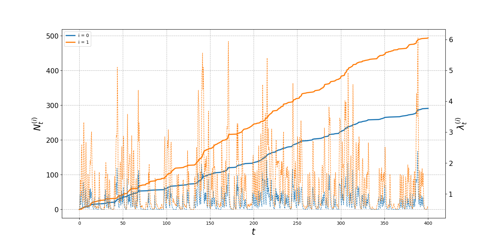
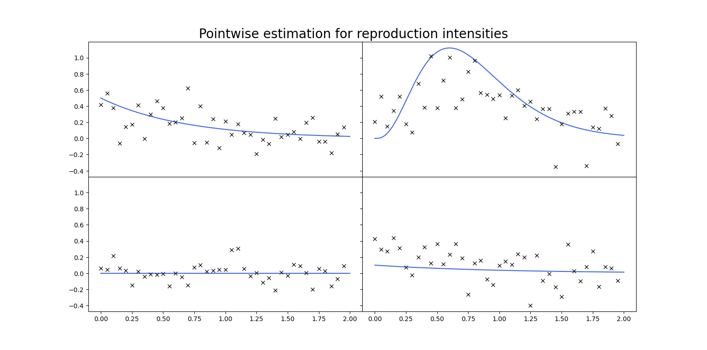
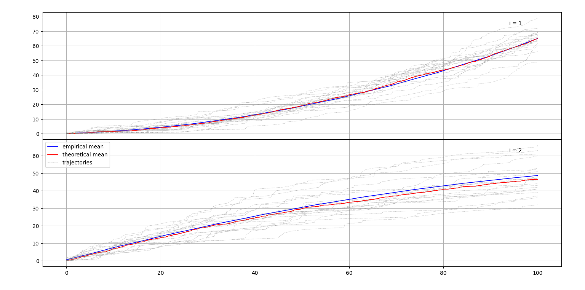

# SIMPLE HAWKES LIB
---
This library is simplified implementation of core algorithms for my master-thesis.

Conceptually, submitted code intentionally introduces strong explicitness and austerity preference over performance and architecture.

## Features:
- multivariate hawkes process (**MHP**) simulation
  - with thinning-like approach
  - with branching-structure
- theoretical mean approximation for exponential kernel intensity hakwes
- branching-structure coefficients estimation (with point-wise excitation functions estimation)
- logL estimation, based on analytically derived gradient

## Examples:

Within library, few examples are attached for a guidance. Every example is implemented in function inside python's `__main__` block. For running selected example, uncommenting function call and running as a *hawkes.py* as a script is sufficient.

## Images:

Following charts can be created by calling attached examples.

---